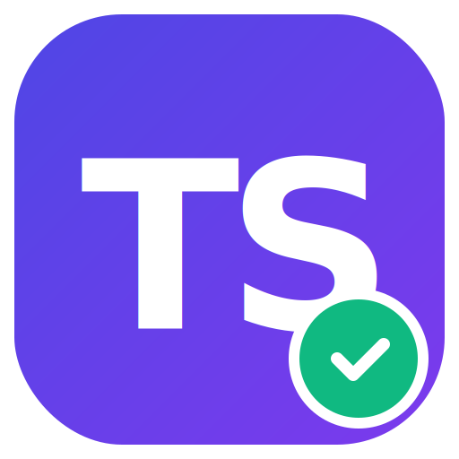

<div align="center">
  
  <h1>TathyaSetu (તથ્યસેતુ) 🌉</h1>
  <p><strong>The Bridge to Truth in the Age of AI.</strong></p>
  
  <p>
    A professional, multi-modal misinformation checker powered by <strong>Google Gemini 3</strong>, <strong>Google Search Grounding</strong>, and <strong>Real-time Fact Check Databases</strong>.
  </p>

  <div align="center">
    <a href="#-features">Features</a> •
    <a href="#-tech-stack">Tech Stack</a> •
    <a href="#-getting-started">Getting Started</a> •
    <a href="#-chrome-extension">Extension</a> •
    <a href="#-whatsapp-bot">WhatsApp Bot</a>
  </div>

  <br />

  
  
  
  
  
  
</div>

<br />

## 📖 About The Project

**TathyaSetu** (Sanskrit for *Bridge of Truth*) is a unified verification ecosystem designed to combat viral misinformation in India and beyond. 

Unlike standard AI chatbots that "hallucinate" answers, TathyaSetu uses **Google Search Grounding** to cross-reference claims against the live web. It specifically targets high-authority sources and existing fact-checks (Snopes, Alt News, PIB) to provide an evidence-based verdict.

It is available on three platforms:
1.  **Web Dashboard:** For deep analysis of text, audio, and video.
2.  **Chrome Extension:** For instant verification while browsing news sites.
3.  **WhatsApp Bot:** For checking viral forwarded messages on the go.

---

## ✨ Key Features

### 🧠 Advanced AI Analysis
*   **Gemini 3 Reasoning:** Uses the latest Gemini 3 Flash model for rapid logical deduction and bias detection.
*   **Live Grounding:** Connects to Google Search API to fetch real-time evidence, citing sources with favicons and trust indicators.
*   **Fact Check Database:** Automatically identifies if a claim has *already* been debunked by major fact-checking organizations and links directly to their report.

### ⚡ Multi-Modal Inputs
*   **Text & Links:** Paste articles or URLs.
*   **Audio Forensics:** Upload or record voice notes (supports MP3/WAV).
*   **Visual Context:** Analyze images and videos for context manipulation.

### 🌏 Hyper-Localized for India
*   **12 Languages:** Full interface and analysis support for **Hindi, English, Hinglish, Bengali, Tamil, Telugu, Marathi, Gujarati, Kannada, Malayalam, Punjabi, and Urdu**.
*   **Native TTS:** Listen to the analysis in your local language using `gemini-2.5-flash-preview-tts`.

### 🛠️ Developer Experience
*   **Conversational Follow-up:** "Chat with the Verdict" allows users to ask specific questions about the analysis.
*   **News Feed:** Auto-fetches trending misinformation topics based on the selected region.

---

## 🏗️ Tech Stack

| Component | Technology |
| :--- | :--- |
| **Frontend** | React 19, TypeScript, Tailwind CSS, Lucide React |
| **AI Core** | Google Gemini 3 Flash, Gemini 2.5 (TTS), Google Search Tool |
| **Build System** | Vite (Custom configs for Web & Extension) |
| **Extension** | Manifest V3, React Injection |
| **Bot Backend** | Node.js, Express, Twilio API |

---

## 🚀 Getting Started

### Prerequisites
*   **Node.js** (v18+)
*   **Google Gemini API Key** (Get it at [Google AI Studio](https://aistudio.google.com/))
*   **Twilio Account** (Optional, only for WhatsApp Bot)

### 1. Installation

```bash
git clone https://github.com/yourusername/tathyasetu.git
cd tathyasetu
npm install
```

### 2. Environment Configuration

Create a `.env` file in the root directory:

```env
# Required for Web App, Extension, and Bot
API_KEY=your_google_gemini_api_key_here

# Required ONLY for WhatsApp Bot
TWILIO_ACCOUNT_SID=your_twilio_sid
TWILIO_AUTH_TOKEN=your_twilio_token
PORT=3000
```

### 3. Run Web Application

```bash
npm run dev
```
Open `http://localhost:5173` in your browser.

---

## 🧩 Chrome Extension Setup

Verify claims without leaving your tab.

1.  **Build** the extension:
    ```bash
    npm run build:extension
    ```
    *(This creates a `dist-extension` folder)*
2.  **Install** in Chrome/Edge/Brave:
    *   Go to `chrome://extensions`
    *   Enable **Developer Mode** (top right toggle).
    *   Click **Load unpacked**.
    *   Select the `dist-extension` folder from your project.
3.  **Usage**: 
    *   Highlight text on any webpage.
    *   Right Click → **"Verify with TathyaSetu"**.
    *   Or click the extension icon to verify the current page URL.

---

## 🤖 WhatsApp Bot Setup

TathyaSetu includes a backend to handle WhatsApp messages via Twilio.

### Option A: Vercel (Serverless) - *Recommended*
1.  Deploy this repo to **Vercel**.
2.  Add environment variables (`API_KEY`, `TWILIO_...`) in Vercel settings.
3.  In **Twilio Console > WhatsApp Sandbox Settings**:
    *   Set **"When a message comes in"** to: `https://your-project.vercel.app/api/webhook`

### Option B: Local / VPS (Node.js)
1.  Run the standalone server:
    ```bash
    node server/index.js
    ```
2.  Expose port 3000 via **ngrok**:
    ```bash
    ngrok http 3000
    ```
3.  Set Twilio Webhook to your ngrok URL (`https://xyz.ngrok.io/webhook`).

---

## 📂 Project Structure

```bash
tathyasetu/
├── api/                  # Vercel Serverless Function (WhatsApp Webhook)
├── server/               # Standalone Node.js Server (Alternative Bot backend)
├── extension/            # Chrome Extension source (Manifest V3)
│   ├── popup.tsx         # Extension UI logic
│   └── background.js     # Background worker
├── src/
│   ├── components/       # UI Components (ResultCard, InputForm, etc.)
│   ├── services/         # Gemini API Integration & Prompts
│   ├── translations.ts   # Localization for 12 languages
│   └── types.ts          # TypeScript Definitions
├── vite.config.ts        # Web App Build Config
└── vite.extension.config.ts # Extension Build Config
```

---

## 🤝 Contributing

Contributions are welcome! Please follow these steps:
1.  Fork the Project.
2.  Create your Feature Branch (`git checkout -b feature/AmazingFeature`).
3.  Commit your Changes (`git commit -m 'Add some AmazingFeature'`).
4.  Push to the Branch (`git push origin feature/AmazingFeature`).
5.  Open a Pull Request.

---

## 📄 License

Distributed under the MIT License. See `LICENSE` for more information.
